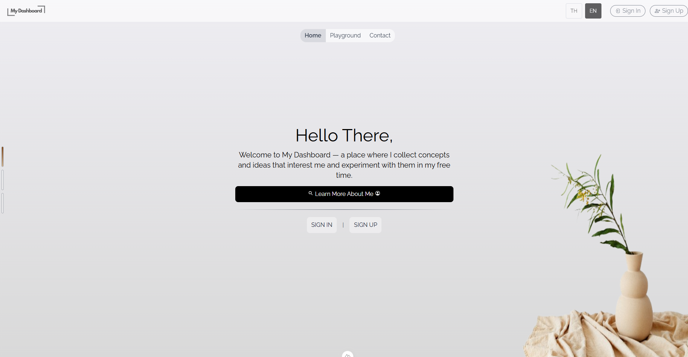

# My Dashboard - Frontend

Modern, responsive web dashboard built with **Nuxt 4**, **Vue 3**, and **Tailwind CSS v4**.



---

## 🚀 Features

- **Nuxt 4 & Vue 3 Composition API**: High-performance SSR/SSG-ready web application with TypeScript.
- **Tailwind CSS v4 & Custom Themes**: Utility-first styling with centralized design tokens and color management.
- **State Management with Pinia**: Global reactive store for authentication, user sessions, and UI states.
- **Internationalization (i18n)**: Multi-language support (English `en`, Thai `th`) via `vue-i18n`.
- **Nuxt Icon**: Fast, flexible SVG icon integration via `@nuxt/icon`.
- **Interactive UI Components**:
  - Carousel banner & dynamic indicator panels
  - Tabbed menu panels
  - Custom containers, buttons, inputs, and skeleton loaders
- **Feature Showcase Pages**:
  - **Dynamic Filter**: Real-time filtering and search interface
  - **Google Maps API**: Interactive maps and location services integration
  - **SCB Open API**: Financial/Banking API integration showcase
  - **About Me**: Developer profile & portfolio showcase
- **Notifications**: Toast alerts via `vue3-toastify`.

---

## 🛠️ Tech Stack

| Category | Technology |
| :--- | :--- |
| **Framework** | [Nuxt 4](https://nuxt.com/) (Vue 3) |
| **Language** | TypeScript / JavaScript |
| **Styling** | [Tailwind CSS v4](https://tailwindcss.com/) + `@tailwindcss/vite` |
| **State Management** | [Pinia](https://pinia.vuejs.org/) + `@pinia/nuxt` |
| **Localization** | [Vue I18n](https://vue-i18n.intlify.dev/) |
| **Icons** | [Nuxt Icon](https://nuxt.com/modules/icon) |
| **Package Manager** | Yarn |

---

## 📁 Project Structure

```text
My_Dashboard_Front/
├── app/
│   ├── assets/          # CSS stylesheets and global design tokens
│   ├── components/      # Reusable UI components (buttons, banners, carousels, inputs, etc.)
│   ├── composables/     # Shared Vue composables
│   ├── config/          # Client-side configuration constants
│   ├── enums/           # TypeScript enums
│   ├── lang/            # Localization dictionary files (en.json, th.json)
│   ├── pages/           # Application routes (index, about-me, dynamic-filter, scb-api, etc.)
│   ├── plugins/         # Nuxt plugins (api client, i18n setup)
│   ├── store/           # Pinia stores (auth, user, etc.)
│   ├── types/           # TypeScript interfaces and type definitions
│   ├── app.vue          # Root Vue component with layout wrapper
│   └── error.vue        # Custom error page
├── public/              # Static assets (favicons, images)
├── Dockerfile           # Multi-stage production container build
├── docker-compose.yml   # Frontend service container configuration
├── nuxt.config.ts       # Nuxt 4 configuration
└── package.json         # Dependencies and scripts
```

---

## ⚙️ Environment Variables

Create a `.env` file in the root of the frontend folder:

```bash
cp .env.example .env
```

| Variable | Description | Example |
| :--- | :--- | :--- |
| `PUBLIC_API_BASE_URL` | Base endpoint URL for the backend REST API | `http://localhost:3010/api` |

---

## 📦 Getting Started

### Prerequisites

- **Node.js** >= 20.x (Recommended: Node 22 LTS)
- **Yarn** (v1.22.x)

### 1. Install Dependencies

```bash
yarn install
```

### 2. Run Development Server

```bash
yarn dev
```

The application will be available at `http://localhost:3000`.

### 3. Build for Production

```bash
# Build the application
yarn build

# Preview the production build locally
yarn preview
```

---

## 🐳 Docker Deployment

### Build and Run with Docker

```bash
# Build Docker image
docker build -t my-dashboard-front .

# Run container on port 3000
docker run -d -p 3000:3000 --env-file .env.prod --name my-dashboard-front my-dashboard-front
```

### Run with Docker Compose

```bash
docker compose up -d
```